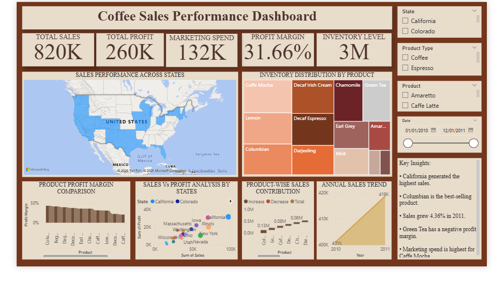
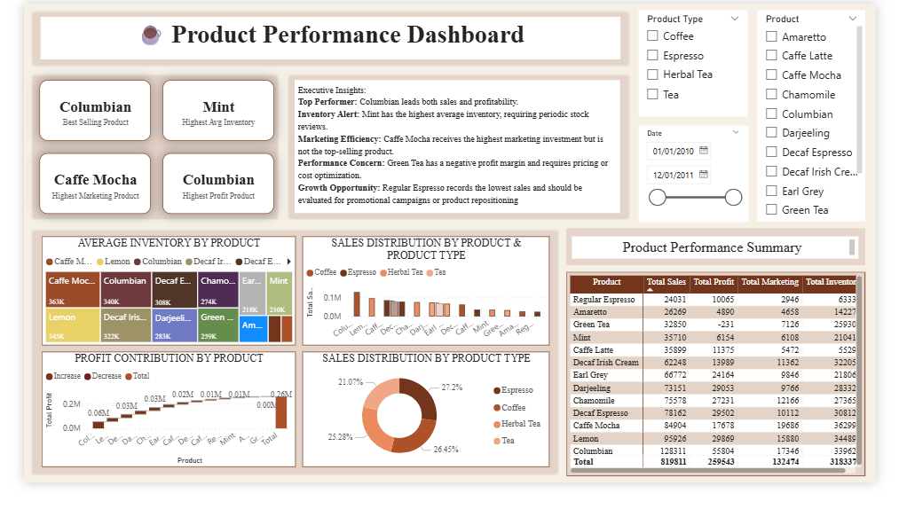
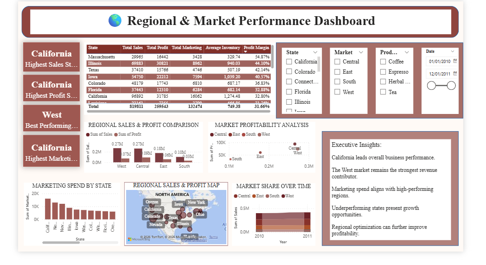

# ☕ Coffee Sales Performance Analysis

An end-to-end SQL Server + Power BI business intelligence project analysing transactional coffee sales data to uncover sales, product, and regional performance insights.


---

## Project Overview

This project analyses transactional coffee sales data to understand how the business is performing across products and markets. It uses SQL Server for data preparation, transformation, and analytical querying, and Power BI to turn that analysis into an interactive dashboard that communicates the findings clearly.

The goal is to move from raw transactional records to decision-ready insight — the kind of workflow a data or business analyst would run to support real business decisions.

---

## Business Objective

The analysis is built around a few practical objectives:

- Understand overall coffee sales performance
- Identify which products contribute most to sales
- Compare performance across different regions or markets
- Surface patterns that support business decision-making
- Communicate the analysis through a clear, interactive dashboard

---

## Business Questions

- How is overall coffee sales performance trending?
- Which products contribute most strongly to sales?
- How does performance vary across markets or locations?
- What patterns can be identified from the sales data?
- How can this analysis support business decisions?

---

## Analytical Approach

**Data → SQL Server → Data Preparation → SQL Analysis → Power BI → Business Insights**

**01 — Data Preparation**
Source transactional sales data is prepared for analysis.

**02 — SQL Server**
SQL Server and T-SQL are used for querying, transformation, and analytical processing.

**03 — Business Analysis**
Relevant sales metrics and comparisons are developed to evaluate performance across products and markets.

**04 — Power BI**
The analysis is transformed into an interactive Power BI dashboard.

**05 — Insight Communication**
The dashboard presents the analysis in a format suitable for business interpretation and decision-making.

---

## Technology Stack

| Technology | Purpose |
|---|---|
| SQL Server | Data preparation and analytical querying |
| T-SQL | SQL-based analysis and transformations |
| Power BI | Dashboard development and visualization |
| DAX | Analytical measures and calculations |
| Data Cleaning | Preparing data for reliable analysis |

---

## Dashboard Preview

### Sales Summary


### Product Performance


### Regional Market Performance


---

## Key Analysis Areas

**Sales Summary**
Overall sales performance and key business metrics at a glance.

**Product Performance**
Product-level sales contribution and comparative performance.

**Regional Market Performance**
Comparison of sales performance across different markets or locations.

---

## Project Files

| Resource | Description |
|---|---|
| [Power BI Dashboard](dashboards/Coffee%20sales%20project.pbix) | Interactive dashboard file (open in Power BI Desktop) |
| [SQL Analysis](notebooks/Coffee_Sales_Analysis_Master.sql) | SQL Server analysis and queries |
| [Project Report](reports/Coffee_Sales_Analysis_Report.pdf) | Detailed project documentation |
| [Dataset](data/) | Source data used for analysis |
| Dashboard Images | Static previews of the Power BI dashboards (see above) |

---

## Repository Structure

```text
coffee-sales-analysis/
├── index.html
├── assets/
├── dashboards/
├── notebooks/
├── reports/
├── data/
├── README.md
└── LICENSE
```

---

## How to Explore the Project

**Option 1 — Portfolio Page**
Open the deployed GitHub Pages site linked in this repository's About section.

**Option 2 — Dashboard**
Download and open the `.pbix` file using Microsoft Power BI Desktop.

**Option 3 — SQL Analysis**
Open `notebooks/Coffee_Sales_Analysis_Master.sql` to review the queries and analysis.

**Option 4 — Report**
Open `reports/Coffee_Sales_Analysis_Report.pdf` for the full write-up.

---

## Skills Demonstrated

- SQL
- Data Cleaning
- Data Analysis
- Business Intelligence
- Power BI
- DAX
- Data Visualization
- Dashboard Design
- Business Storytelling

---

## Project Outcome

This project demonstrates the ability to take transactional sales data through a complete analytical workflow — from data preparation and SQL-based analysis to an interactive Power BI dashboard — and communicate the resulting insights in a business-ready format.

---

## Author

**Paakhi Agarwal**
BBA (Hons/Research) — Data Analytics

---

## License

This project is licensed under the MIT License. See the [LICENSE](LICENSE) file for details.
